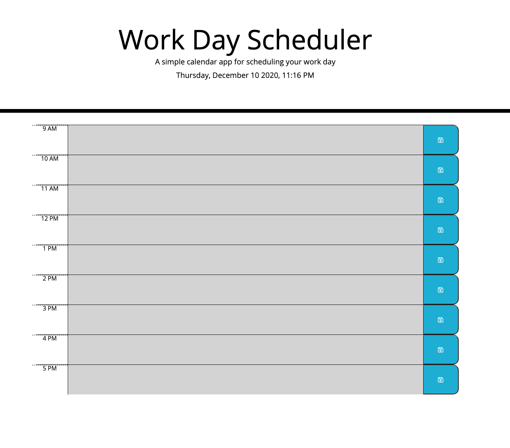

# 5-dayPlanner_PAC
# HW #5: Day Planner
# Due: Thursday, December 10, 2020 @ 11:59pm Local

## User Story
This application is a daily day planner
1. This planner updates the date and time automatically.
2. The day planner allows you to enter text for anything your interedted in scheduling.
3. The day planner will allow you to enter your events in hourly seperatd time slots
4. Day Planner time slots run from the hours 9am to 5pm only.  The day planner is not a 24hr planner.
5. During the hours from 9am - 5pm, the current time is color highlighted to represent the past, present and future time slot.
6. The present time (current hour) is color highlighted - red
7. The future time (the hours that have not yet passed) are in the highlighted color green.
8. Hours that have past are highlighted to gray.
9. You have ample space to enter text input describing your events.
10. To save any user text input, the save button icon to the right of the time slot will save your input.
11. Your input will persist beyond any browser page refreshs.
12. This application uses the following API's: 

* bootstrap
* fontawesome
* google fonts
* jQuery (CDN & minimized file included)
* The Dayjs API 

## There are 5 files in this application:
* index.html
* dayPlannerLogic.js
* style.css
* dayjs.min.js  
* README.md
  

---
---
## Acceptance Criteria

## Using Vanilla Javascript, this application has been coded from scratch to meet the following Acceptance Criteria:
1. Opening the planner displays the current date at the top of the page (CONFIRMED)
2. Scrolling down the planner, the time blocks are displaye for standard 9am - 5pm business hours. (CONFIRMED)
3. Each of the time blocks are color-coded, indicating either the past, present, or future hour. (CONFIRMED)
4. Clicking into any of the time blocks allows the user to enter their event. (CONFIRMED)
5. Clicking the save button will save the users text input. (CONFIRMED)
6. Refreshing the page will keep the users entries in the time slots.  Users input is saved. (CONFIRMED)

 
 

## Screen Shots of the Application:

 
 

## NOTES:
* > This code generates the time block rows and the time, text & buton coloumns in each of the 9am - 5pm time slot rows.
 

---
---
## gitHub repo link & live web link:
 

* `Application GitHub Repo URL:`
https://github.com/streamingTurtles/5-DayPlannerHW_PAC 

* `Application Live GitHub URL:`  https://streamingturtles.github.io/5-DayPlannerHW_PAC/

- - -
- - -
Peter Cardillo, Columbia Engineering Fullstack Bootcamp, 2020-2021